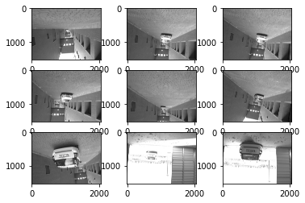
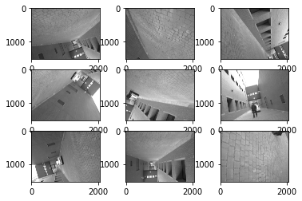
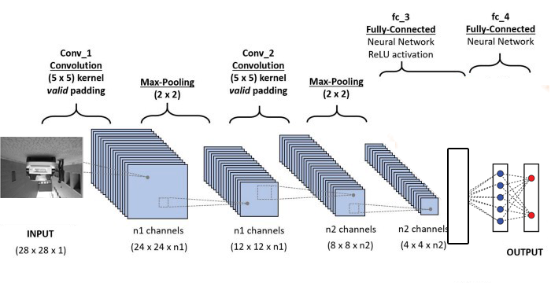

# Anomaly_Detection
Drones are expected to be widely used in near future in the areas of agriculture, surveillance and logistics. The behavior of the autonomous systems, especially the drones, needs to be robust, irrespective of the status of the sensors, environment and the collective conditions of the system. The dynamics of the autonomous system can go into unpredictable behavior because of the faultiness of the sensors, power failure or unexpected environment condition. This work detects whether the state of the drone is in order or not, using multiple streams of video footages. 

  
## Dataset
A dataset of video footages obtained from ground and aerial systems that perform a repetitive task, such as perimeter monitoring. It consists of 12 Rosbag files where total number of normal images is 277 and the number of mixed images is 392.


|         Content     |       LINK       |
|:-------------------:|:----------------:|
|Raw Dataset          |    [Google Drive](https://drive.google.com/drive/folders/1NNB7pVF2bSZBKLMhWjEJW707hMUowH5E?usp=sharing)     |
|Train Test set       |    [Google Drive](https://drive.google.com/drive/folders/1JlRVnEHC0ao_IbY_e1WmwNEg-2aMDJIL?usp=sharing)       |

## Data pre-processing


Install ROS from http://wiki.ros.org/Installation/Windows \
To learn more about ROS: http://wiki.ros.org/ROS/Tutorials

**Installing dependencies**
 ```bat
 pip install -r requirements.txt
 ```
 
Open ros launcher as administrator and start a roscore node
 ```
 roscore
 ```
 
Get information about the .bag file using: (in a new ros launcher window)
 ```
 rosbag info <bagfile.bag>

rostopic -b IMU.bag -p /mavros/global_position/compass_hdg

rostopic echo -b IMU.bag -p /mavros/battery
 ```
 Extract the data to .csv and video footage to images
 ```
rostopic echo -b IMU.bag -p /mavros/battery > battery.csv

rosrun image_view image_view image:=/pylon_camera_node/image_raw/
rosbag play IMU.bag # in seperate window

rosrun image_view extract_images image:=/pylon_camera_node/image_raw/
 ```

## CNN Architecture

